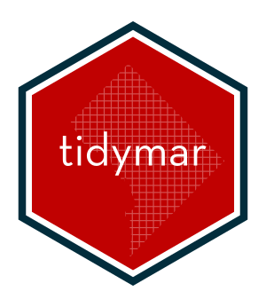

# tidymar 

[](https://www.tidyverse.org/lifecycle/#experimental)

```{r setup, include=FALSE}
knitr::opts_chunk$set(echo = TRUE, eval=FALSE)
library(tidyr)
library(dplyr)
library(tidymar)
```

## DC's Master Address Repository in R

District of Columbia's [Master Address Repository (MAR)](https://dcatlas.dcgis.dc.gov/mar/) provides a [web service](https://opendata.dc.gov/pages/mar-webservices) with geocoding and address verification operations. The `tidymar` package gives R users a set of fuctions to interact with the MAR web service. The MAR web service is free to use and requies no credentialing.

## What's Inside?

Currently only the following function is implemented:

* `find_location()`: Location query for DC addresses, intersections, blocks, and place names


## Installation

You can install the development version from GitHub

```{r installation}
remotes::install_github("hguptadc/tidymar")
```


## Usage

Below is an example of the output provided by the MAR (in long format):

```{r example, eval = TRUE, echo=TRUE}
find_location(address = "1600 Pennsylvania Ave NW") %>% tidyr::gather() %>% print(n=Inf)
```


## Next Steps

* Testing
* Implementing additional functions: [all available endpoints for the MAR webservice](https://citizenatlas.dc.gov/newwebservices/locationverifier.asmx)
